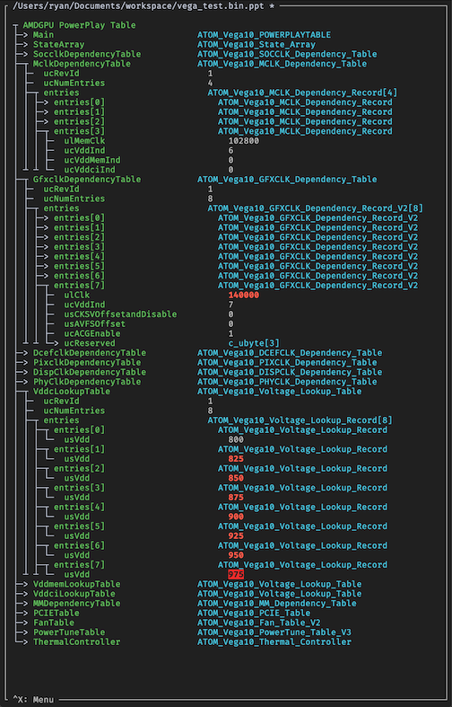

Pipiti - AMD PowerPlay Table Editor
===================================

An ncurses text-based user interface (TUI) for viewing/editing AMD GPU powerplay
tables. Uses amdgpu-pptable library by amezin for backend parsing.

Installation
============

Dependencies:

- python (>=3.6)
- pip3 (for standard installation)

Using pip/github::

    $ pip3 install --user git+https://github.com/rdugan/pipiti.git

Usage
=====

After installing with pip, run::

    $ pipiti

The app will start with a file selection dialog (tab completion supported), from
which you should select a powerplay table in binary format (for example, to load
the current ppt for device 0, select ``/sys/class/drm/card0/device/pp_table``)

Commands
========

The following is a list of the most useful keybindings:

    +----------------+------------------------------------------------------------------+
    | **Keybinding** | **Description**                                                  |
    +----------------+------------------------------------------------------------------+
    | ``SPC``        | expand/collapse section toggle                                   |
    +----------------+------------------------------------------------------------------+
    | ``]``, ``+``   | expand section (multiple keypresses expands subsections)         |
    +----------------+------------------------------------------------------------------+
    | ``[``, ``-``   | collapse section (multiple keypresses collapses parent sections) |
    +----------------+------------------------------------------------------------------+
    | ``}``          | expand all                                                       |
    +----------------+------------------------------------------------------------------+
    | ``{``          | collapse all                                                     |
    +----------------+------------------------------------------------------------------+
    | ``l``          | search values (expanded sections only)                           |
    +----------------+------------------------------------------------------------------+
    | ``n``          | next search match                                                |
    +----------------+------------------------------------------------------------------+
    | ``p``          | previous search match                                            |
    +----------------+------------------------------------------------------------------+
    | ``RET``, ``e`` | edit selected value                                              |
    +----------------+------------------------------------------------------------------+
    | ``^u``         | clear value (while editing)                                      |
    +----------------+------------------------------------------------------------------+
    | ``^X``         | menu                                                             |
    +----------------+------------------------------------------------------------------+
